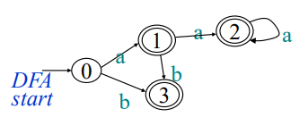

## 개요
### 컴퓨터와 인간이 소통하는 방법
#### 어셈블리어
- 어셈블리어의 번역기는 어셈블러(Assembler)라고 한다
- cpu칩셋이 바뀔때마다 어셈블리어가 바뀐다

#### 고급언어
- 고급언어의 번역기는 컴파일러(Compiler)라고 한다

#### 컴파일러의 정확한 정의
> 어떤 언어로 쓰여진 프로그램을 같은 역할의 다른 언어로 바꿔주는 프로그램
- 1952년 그레이스 호퍼(Grace Hopper)가 UNIVAC용 프로그래밍언어 A-0 컴파일러를 제작

#### 컴파일러 vs 인터프리터

### 프로그램 처리과정

### 컴파일러의 처리 과정

- Lexical analysis (어휘 분석)
  - token을 생성하는일, token은 어휘의 최소 단위
- Syntax analysis (구문 분석)
  - token을 읽어서 오류를 검색, 구문 구조를 만든다 (주로 트리형태)
- Semantic analysis (의미 분석)
  - type checking
- Intermediate code generation (중간 코드 생성)
  - 중간 코드로 변환
- Code optimization (코드 최적화)
  - 중간 코드를 더 효율적으로 변환
- Code generation (코드 생성)
  - 목적 코드 생성

## Lexical analysis (어휘 분석)
- token : 문법적으로 의미있는 최소 단위
### FSA (Finite State Automata, 유한 상태 오토마타)

- token을 인식하는 방법
- 시작 상태 한 개와 끝 상태 여러 개를 가짐

### DFA (Deterministic Finite Automata)

- FSA의 한 종류
- 각 상태에서 뻗어나가는 edge가 하나씩만 존재
- ε가 붙은 edge 없음

### 분석한 토큰을 표현하는 방법
> Lexeme = <토큰번호, 토큰 값>
- 예시
  - if X < Y ...
  - (29, 0) (1, X) (18, 0) (1, Y) ...
  - 식별자의 토큰번호는 1번, 상수는 2번 등으로 고정

## Syntax analysis (구문 분석)
- token을 읽어서 오류를 검색, parse tree를 만든다

### CFG (Context Free Grammer)
- 구문을 표현하는 방법
- G = (N, T, P, S)
  - N = nonterminal symbol
    - 알파벳 대문자로 표현
  - T = terminal symbol (token)
    - 알파벳 소문자+숫자, 연산자, 구분자, 키워드 등
  - P = production rule
    - 예) S -> T+T, T -> '0'|'1'|'2'
  - S = start symbol
- L(G) : 이 문법으로 생성되는 언어

### 여러가지 CFG 표현법
- BNF (Backus-Naur Form)
- EBNF (Extended BNF)

### 유도 (derivation)
- 생성 규칙를 적용하여 문장을 생성하는 과정
- 유도를 하는 과정에서 하나씩 골라서 바꿈
- 유도 트리 : 유도 경로를 추상화 시켜 표현한 것
- 좌측 유도(leftmost derivation)
  - 가장 왼쪽에 있는 nonterminal을 먼저 대치
- 우측 유도(rightmost derivation)
  - 가장 오른쪽에 있는 nonterminal을 먼저 대치

### 모호성 (ambiguity)
- 문법 G에 의해 생성되는 어떤 문장이 두개 이상의 유도트리를 갖는다면 문법 G는 모호하다고 한다
- 모호하지 않은 문법은 좌측 유도와 우측 유도가 같다
- 모호성 해결
  1. **연산자 우선순위 도입**
  2. **결합 법칙 도입**

### 구문 분석
- Top-down 방식
  - 좌측 유도와 같은 순선의 생성 규칙 적용
- Bottom-up 방식
  - 우측 유도의 역순의 생성 규칙 적용
